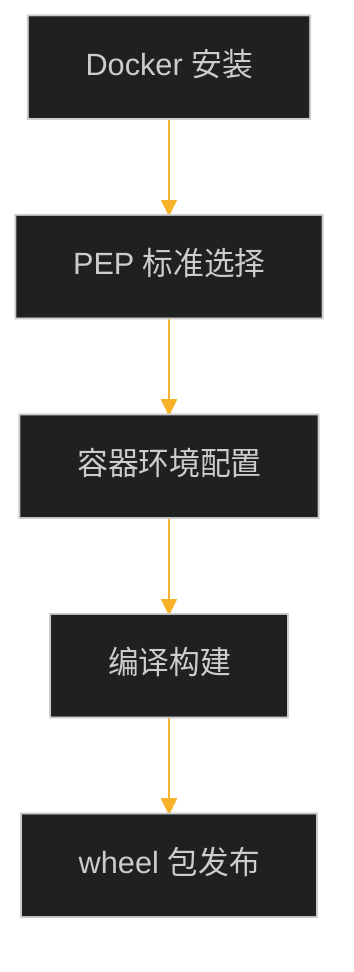

## PyPI 与 PyPA 简介

##### PyPI（Python Packages Index）
[PyPI](https://pypi.org/) 全称是“Python 包索引”，是 Python 的软件仓库，开发者可以将开发的软件打包并发布至 PyPI ，供其他开发者搜索并安装、使用。

##### PyPA（Python Packaging Authority）
[PyPA](https://www.pypa.io/en/latest/) 全称是“Python 打包权威机构”，该组织制定 Python 软件打包标准规范，负责维护 Python 打包中使用的一组核心工具，[pypa.io](https://www.pypa.io/en/latest/specifications.html) 上记录了更新这些标准和提出新标准的过程。

## PyPA 相关项目

##### manylinux
[manylinux](https://github.com/pypa/manylinux) 项目的目标是提供一种便捷的在 Linux 上将 Python 发布为二进制 wheel 包的方法，它将各种标准下的环境打包成镜像，提供了 Python 打包的基础环境，目前支持的标准有 [PEP 513](https://www.python.org/dev/peps/pep-0513/)（manylinux1）、[PEP 571](https://www.python.org/dev/peps/pep-0571/)（manylinux 2010）、[PEP 599](https://www.python.org/dev/peps/pep-0599/)（manylinux 2014）和[PEP 600](https://www.python.org/dev/peps/pep-0600/)（manylinux _x_y）。

##### setuptools
[setuptools](https://github.com/pypa/setuptools) 是对 distutils 的增强版，distutils 是 Python 包构建的标准库，但不够易用，setuptools 使开发者构建和发布Python 包更加容易，特别是引入了包依赖的管理。

##### auditwheel
[auditwheel](https://github.com/pypa/auditwheel) 是一个命令行工具，用于帮助创建适用于 Linux 的 Python wheel 包，这些包与各种 Linux 发行版兼容，与 PEP 600 manylinux_x_y、PEP 513 manylinux1、PEP 571 manylinux2010 和 PEP 599 manylanux2014 平台标签一致。

##### twine
[twine](https://github.com/pypa/twine) 是一个用于在 PyPI 上发布 Python 包的实用程序，它可以将本地构建的包上传至 PyPI 上的新项目或现有项目中。

##### pip
[pip](https://github.com/pypa/pip) 是 Python 的包安装程序，可以使用 pip 从 PyPI 、其他索引或本地安装包。

## wheel 包发布流程

whell 包发布基本流程如下图，首先要安装 Docker，manylinux 项目已经将各种标准环境打包成了镜像，当我们确定了要遵循的标准后，就可以拉取相应的镜像，启动容器后，在容器中进行软件依赖软件的配置，编译与构建的步骤与在其它服务器上步骤一样，最后利用 twine 工具进行 wheel 包的上传



本文以 ONNX Runtime 项目 CANN 版本的软件包发布为例，详细描述整个过程

## PEP 容器环境搭建

##### Docker 安装
参考[官方文档](https://docs.docker.com/engine/install/ubuntu/#install-using-the-repository)
```shell
# 卸载旧 版本
for pkg in docker.io docker-doc docker-compose podman-docker containerd runc; do sudo apt-get remove $pkg; done

# 更新 apt 索引，并安装以下包以允许apt通过HTTPS使用存储库
sudo apt-get update
sudo apt-get install ca-certificates curl gnupg

# 添加 Docker’s official GPG key:
sudo install -m 0755 -d /etc/apt/keyrings
curl -fsSL https://download.docker.com/linux/ubuntu/gpg | sudo gpg --dearmor -o /etc/apt/keyrings/docker.gpg
sudo chmod a+r /etc/apt/keyrings/docker.gpg

# 设置仓库
echo \
"deb [arch="$(dpkg --print-architecture)" signed-by=/etc/apt/keyrings/docker.gpg] https://download.docker.com/linux/ubuntu \
"$(. /etc/os-release && echo "$VERSION_CODENAME")" stable" | \
sudo tee /etc/apt/sources.list.d/docker.list > /dev/null

# 更新 apt 索引
sudo apt-get update

# 安装 Docker Engine, containerd, 和 Docker Compose
sudo apt-get install docker-ce docker-ce-cli containerd.io docker-buildx-plugin docker-compose-plugin

# 验证安装是否成功
sudo docker run hello-world
```

##### 容器启动
我们基于 manylinux2014 规范在 x86 架构下构建，在[官网](https://github.com/pypa/manylinux)选择对应的镜像

```shell
# 拉取镜像
docker pull quay.io/pypa/manylinux2014_x86_64

# 交互式启动镜像
docker run -it --name=manylinux quay.io/pypa/manylinux2014_x86_64 /bin/bash

# 将 CANN 开发套件从宿主机拷贝至容器，或直接在容器中下载
docker cp Ascend-cann-toolkit_6.3.RC2.alpha002_linux-x86_64.run <container_id>:/root/install
```
##### 环境搭建

```shell
# 若没有在容器内，先在宿主机终端进入容器
docker exec -it <container_id> /bin/bash

# 建立 Python3 环境
ln -s /opt/python/cp38-cp38/bin/python /usr/bin/python3
ln -s /opt/python/cp38-cp38/bin/pip /usr/bin/pip3

# 安装 CANN 依赖
yum install -y gcc gcc-c++ make cmake unzip zlib-devel libffi-devel openssl-devel sqlite-devel blas-devel lapack-devel openblas-devel pciutils net-tools

# 安装 CANN 套件
./Ascend-cann-toolkit_6.3.RC2.alpha002_linux-x86_64.run --install
```

## ONNX Runtime 编译构建

##### 安装依赖

```shell
# git 依赖该软件
yum install less

# 安装 Python 依赖
pip3 install attrs numpy decorator sympy cffi pyyaml pathlib2 psutil protobuf scipy requests -i https://pypi.tuna.tsinghua.edu.cn/simple

# 安装 Python 包修复工具
pip3 install auditwheel patchelf
```

##### 配置环境变量
```shell
# 构建的包名会用到
export AUDITWHEEL_PLAT=manylinux2014_x86_64

# CANN 环境变量
source /usr/local/Ascend/ascend-toolkit/set_env.sh
```

##### 编译构建
```shell
# 下载对应版本的分支
git clone -b v1.15.0 --recursive https://github.com/Microsoft/onnxruntime.git

# 编译构建 由于docker环境中没有 Ascend 驱动，测试肯定不过，需要跳过测试 --skip_tests
setsid ./build.sh --allow_running_as_root --config Release --skip_tests --build_shared_lib --parallel --use_cann --build_wheel &>/root/Projects/build.log &
```
##### 验证
编译完成后，需要在有 Ascend 驱动的环境进行验证

```shell
docker cp bfd0c593d5a0:/root/onnxruntime/build/Linux/Release/dist/onnxruntime_cann-1.15.0-cp38-cp38-manylinux_2_17_x86_64.manylinux2014_x86_64.whl ~/install

cd ~/install
pip install onnxruntime_cann-1.15.0-cp38-cp38-manylinux_2_17_x86_64.manylinux2014_x86_64.whl

python test.py # 测试脚本
```

#### 发布 wheel 包
由于 ONNX Runtime 自带的编译构建脚本集成了 auditwheel 工具对构建包的修复，所以构建好的包可以直接上传至 PyPI，代码片段如下
```python
    ......
    _bdist_wheel.run(self)
    if is_manylinux and not disable_auditwheel_repair and not is_openvino:
        assert self.dist_dir is not None
        file = glob(path.join(self.dist_dir, "*linux*.whl"))[0]
        logger.info("repairing %s for manylinux1", file)
        try:
            subprocess.run(
                ["auditwheel", "repair", "-w", self.dist_dir, file], check=True, stdout=subprocess.PIPE
            )
        finally:
            logger.info("removing %s", file)
            remove(file)
    ......
```

```shell
# 下载 twine 发布工具
pip3 install twine -i https://pypi.tuna.tsinghua.edu.cn/simple

# 使用 twine 发布到 PyPI，过程会要求输入用户ID和密码
python3 -m twine upload onnxruntime_cann-1.15.0-cp38-cp38-manylinux_2_17_x86_64.manylinux2014_x86_64.whl --verbose
```
