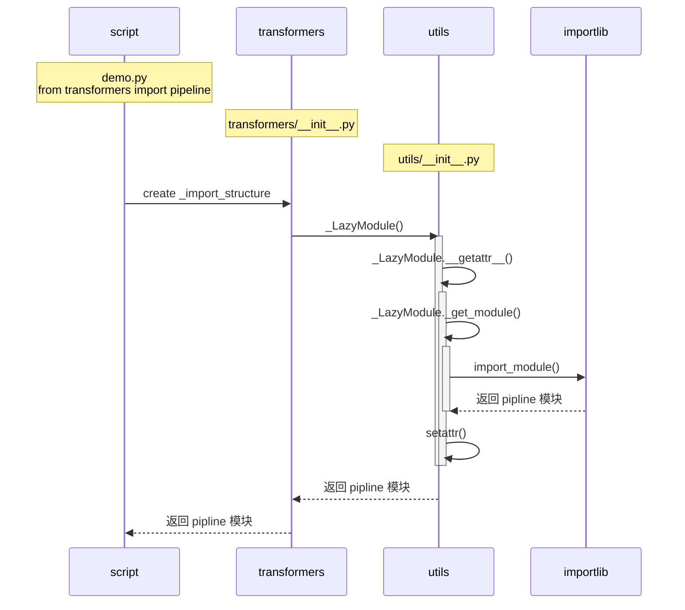

## 引用机制和流程

`transformers` 目录结构如下，核心模块包括 `models`, `pipelines`, `generation` 等。它将绝大多数子模块和类的引用包装在最外层，以便开发者使用，因此在顶层初始化文件 `transformers/__init__.py` 中做了大量的引用。例如类 `transformers.models.bert.BertModel` 可以通过 `from transformers import BertModel` 引用

```bash
transformers
├── benchmark
├── commands
├── data
├── generation
├── kernels
├── models
├── onnx
├── pipelines
├── __pycache__
├── sagemaker
├── tools
└── utils
```

最外层模块初始化文件 [`transformers/__init__.py`](https://github.com/huggingface/transformers/blob/main/src/transformers/__init__.py) 代码框架和注解如下

```python
...
# 第一步：引用工具函数，下面会用到这些工具函数

from .utils import (
    OptionalDependencyNotAvailable,
    _LazyModule,
    is_bitsandbytes_available,
    is_flax_available,
    is_keras_nlp_available,
    ...
)

# 第二步：创建基础对象引用字典，这些对象是通用的，独立于后端的
# Base objects, independent of any specific backend
_import_structure = {
    "audio_utils": [],
    "benchmark": [],
    "commands": [],
    "configuration_utils": ["PretrainedConfig"],
    "convert_graph_to_onnx": [],
    "convert_slow_tokenizers_checkpoints_to_fast": [],
    "convert_tf_hub_seq_to_seq_bert_to_pytorch": [],
    ...

# 第三步：创建后端对象的引用字典，这些后端包括 entencepiece，Pytorch，TF 等
# sentencepiece-backed objects
try:
    if not is_sentencepiece_available():
        raise OptionalDependencyNotAvailable()
except OptionalDependencyNotAvailable:
    from .utils import dummy_sentencepiece_objects

    _import_structure["utils.dummy_sentencepiece_objects"] = [
        name for name in dir(dummy_sentencepiece_objects) if not name.startswith("_")
    ]
else:
    _import_structure["models.albert"].append("AlbertTokenizer")
    ...

# PyTorch-backed objects
try:
    if not is_torch_available():
        raise OptionalDependencyNotAvailable()
except OptionalDependencyNotAvailable:
    from .utils import dummy_pt_objects

    _import_structure["utils.dummy_pt_objects"] = [name for name in dir(dummy_pt_objects) if not name.startswith("_")]
else:
    _import_structure["activations"] = []
    ...

       
# Direct imports for type-checking
if TYPE_CHECKING:
    # Configuration
    ...

# 第四步：创建 _LazyModule 实例，实现动态引用
else:
    import sys

    sys.modules[__name__] = _LazyModule(
        __name__,
        globals()["__file__"],
        _import_structure,
        module_spec=__spec__,
        extra_objects={"__version__": __version__},
    )
...
```

步骤分为

1. 引用工具函数
2. 创建基础对象的引用字典
3. 创建后端对象的引用字典
4. 创建 _LazyModule 实例，实现动态引用

这里”引用字典“对应着变量 `_import_structure`，key 存储子模块，value 存储类/方法，子模块可以是一级也可以是多级，类/方法可以是多个组成的列表，也可以是空列表，例如

```python
# 多级子模块，多个对象
_import_structure["models.albert"] = ["ALBERT_PRETRAINED_CONFIG_ARCHIVE_MAP", "AlbertConfig"]

# 一级子模块，一个对象
_import_structure["training_args"] = ["TrainingArguments"]

# 只有子模块，无对象
_import_structure["convert_graph_to_onnx"] = []
```

引用字典存储了所有可以从最外层 `transformers` 模块引用的子模块和对象，但是，子模块和对象众多，如果在不使用的情况下直接通过初始化文件进行引用，势必造成内存的浪费；例如，`models` 模块下就包含几百个对象，通常一个程序只使用其中的几个，为了解决这个问题， `transformers` 构建了 `_LazyModule` 类，可以实现动态的引用，即在初始化 `transformers` 模块时只做了极少数必要的引用，而绝大多数子模块和类都存储在了引用字典 `_import_structure` 中，当外部程序引用一个新对象时，`_LazyModule` 从引用字典中索引到该对象，并完成相关子模块和对象的引用

另外一个问题是，`transformers` 库使用了大量 LLM 相关的三方库，这些三方库有些具有相同的功能，但可能跟使用者的使用习惯和使用场景相关，比如 `sentencepiece` 和 `tokenizers` 都用于分词，`Pytorch`, `TensorFlow`, `JAX` 都可以作为 `transformers` 的深度学习框架，这些库都称为“后端”（backend）；通常这些后端不同时存在，例如，开发环境只有 `Pytorch` 框架, 但开发者可能会错误地引用 `Tensorflow` 后端的类/方法，为了提示开发者，`transformers` 构建了虚拟后端类 `DummyObject`，在发生引用的类/模块与后端不匹配时，会抛出异常

## 即时引用类 `_LazyModule`

`_LazyModule` 定义如下，继承自模块类型 `ModuleType`，从初始函数看出需要将引用字典 `_import_structure` 保存为成员变量，并建立类/方法到模块的反向索引字典 `_class_to_module`，`ModuleType` 类创建完毕时，并没有对引用字典 `_import_structure` 中的类/方法做实际引用；当外部代码第一次引用模块的类/方法时，调用 `__getattr__` 方法，该方法逻辑是从反向索引字典定位到要引用的子模块，并通过 `importlib.import_module` 完成实际引用，将引用的类/方法通过 `setattr` 保存至属性，后面的引用相同的类/方法时，会直接获取该属性，而不会再重复执行 `__getattr__`

```python

# transformers/utils/import_utils.py
from types import ModuleType

class _LazyModule(ModuleType):
    """
    Module class that surfaces all objects but only performs associated imports when the objects are requested.
    """

    # Very heavily inspired by optuna.integration._IntegrationModule
    # https://github.com/optuna/optuna/blob/master/optuna/integration/__init__.py
    def __init__(self, name, module_file, import_structure, module_spec=None, extra_objects=None):
        super().__init__(name)
        self._modules = set(import_structure.keys())
        self._class_to_module = {}
        for key, values in import_structure.items():
            for value in values:
                self._class_to_module[value] = key
        # Needed for autocompletion in an IDE
        self.__all__ = list(import_structure.keys()) + list(chain(*import_structure.values()))
        self.__file__ = module_file
        self.__spec__ = module_spec
        self.__path__ = [os.path.dirname(module_file)]
        self._objects = {} if extra_objects is None else extra_objects
        self._name = name
        self._import_structure = import_structure

    # Needed for autocompletion in an IDE
    def __dir__(self):
        result = super().__dir__()
        # The elements of self.__all__ that are submodules may or may not be in the dir already, depending on whether
        # they have been accessed or not. So we only add the elements of self.__all__ that are not already in the dir.
        for attr in self.__all__:
            if attr not in result:
                result.append(attr)
        return result

    def __getattr__(self, name: str) -> Any:
        if name in self._objects:
            return self._objects[name]
        if name in self._modules:
            value = self._get_module(name)
        elif name in self._class_to_module.keys():
            module = self._get_module(self._class_to_module[name])
            value = getattr(module, name)
        else:
            raise AttributeError(f"module {self.__name__} has no attribute {name}")

        setattr(self, name, value)
        return value

    def _get_module(self, module_name: str):
        try:
            return importlib.import_module("." + module_name, self.__name__)
        except Exception as e:
            raise RuntimeError(
                f"Failed to import {self.__name__}.{module_name} because of the following error (look up to see its"
                f" traceback):\n{e}"
            ) from e

    def __reduce__(self):
        return (self.__class__, (self._name, self.__file__, self._import_structure))

```

调用时序如下所示



>这里的即时引用是相对全量引用而言，只有当外层代码对某个类/方法进行引用后，模块才会在内部实际执行引用

## 虚拟后端类 `DummyObject`

在最外层模块初始化过程中，构建后端引用字典时，下代码面以 `tokenizers` 后端为例，如果该后端库存在，则执行 else 分支，进行字典构建；如果不存在，抛出 `OptionalDependencyNotAvailable` 异常，并将相关类/方法都添加到 `utils.dummy_tokenizers_objects` 子模块键值中

```python
# transformers/__init__.py

# tokenizers-backed objects
try:
    if not is_tokenizers_available():
        raise OptionalDependencyNotAvailable()
except OptionalDependencyNotAvailable:
    from .utils import dummy_tokenizers_objects

    _import_structure["utils.dummy_tokenizers_objects"] = [
        name for name in dir(dummy_tokenizers_objects) if not name.startswith("_")
    ]
else:
    # Fast tokenizers structure
    _import_structure["models.albert"].append("AlbertTokenizerFast")
    _import_structure["models.bart"].append("BartTokenizerFast")
    _import_structure["models.barthez"].append("BarthezTokenizerFast")
    _import_structure["models.bert"].append("BertTokenizerFast")
    _import_structure["models.big_bird"].append("BigBirdTokenizerFast")
    _import_structure["models.blenderbot"].append("BlenderbotTokenizerFast")
```

打开 `utils.dummy_tokenizers_objects` 子模块，可以看到该模块下定义的类全部继承自虚拟后端元类 `DummyObject`，并定义了类成员变量 `_backends` 来指明该类依赖的后端，初始化函数会调用 `requires_backends` 来抛出后端异常


```python
# transformers/utils/dummy_tokenizers_objects.py

class AlbertTokenizerFast(metaclass=DummyObject):
    _backends = ["tokenizers"]

    def __init__(self, *args, **kwargs):
        requires_backends(self, ["tokenizers"])


class BartTokenizerFast(metaclass=DummyObject):
    _backends = ["tokenizers"]

    def __init__(self, *args, **kwargs):
        requires_backends(self, ["tokenizers"])


class BarthezTokenizerFast(metaclass=DummyObject):
    _backends = ["tokenizers"]

    def __init__(self, *args, **kwargs):
        requires_backends(self, ["tokenizers"])
```


`DummyObject` 类定义如下，重写了 `__getattribute__` 方法，该方法对传入的 `key` 调用了 `requires_backends` 方法，继承该类后，任何属性的访问都会通过 `requires_backends` 抛出异常

```python
# transformers/utils/import_utils.py

class DummyObject(type):
    """
    Metaclass for the dummy objects. Any class inheriting from it will return the ImportError generated by
    `requires_backend` each time a user tries to access any method of that class.
    """

    def __getattribute__(cls, key):
        if key.startswith("_") and key != "_from_config":
            return super().__getattribute__(key)
        requires_backends(cls, cls._backends)

```

`requires_backends` 方法定义如下，主要作用是从已经定义好的后端检查函数/异常信息映射表 `BACKENDS_MAPPING` 中，提取相应的异常信息进行抛出

```python
# transformers/utils/import_utils.py

def requires_backends(obj, backends):
    if not isinstance(backends, (list, tuple)):
        backends = [backends]

    name = obj.__name__ if hasattr(obj, "__name__") else obj.__class__.__name__

    # Raise an error for users who might not realize that classes without "TF" are torch-only
    if "torch" in backends and "tf" not in backends and not is_torch_available() and is_tf_available():
        raise ImportError(PYTORCH_IMPORT_ERROR_WITH_TF.format(name))

    # Raise the inverse error for PyTorch users trying to load TF classes
    if "tf" in backends and "torch" not in backends and is_torch_available() and not is_tf_available():
        raise ImportError(TF_IMPORT_ERROR_WITH_PYTORCH.format(name))

    checks = (BACKENDS_MAPPING[backend] for backend in backends)
    failed = [msg.format(name) for available, msg in checks if not available()]
    if failed:
        raise ImportError("".join(failed))

```

以上是 `transformer` 模块初始化的基本机制，该机制也嵌套式地应用在内层各个子模块中，以此来最大化节省内存

## 内存对比

下面代码简单统计了，只引用 `transformer` 最外层模块和引用 `transformer` 所有类/方法的内存占用对比；只引用最外层时，并没有发生实际引用，只是建立了引用字典，所以内存占用只有 88 MB；而引用所有类/方法后，内部通过即时引用类 `_LazyModule` 发生实际引用，内存占比达到 678 MB

```python
import os
import psutil
import transformers
print('内存占用 {:.2f} MB'.format(psutil.Process(os.getpid()).memory_full_info().uss / 1024. /1024.))
```

```
内存占用 88.48 MB
```


```python
from transformers import *
print('内存占用 {:.2f} MB'.format(psutil.Process(os.getpid()).memory_full_info().uss / 1024. /1024.))
```

```
内存占用 678.26 MB
```