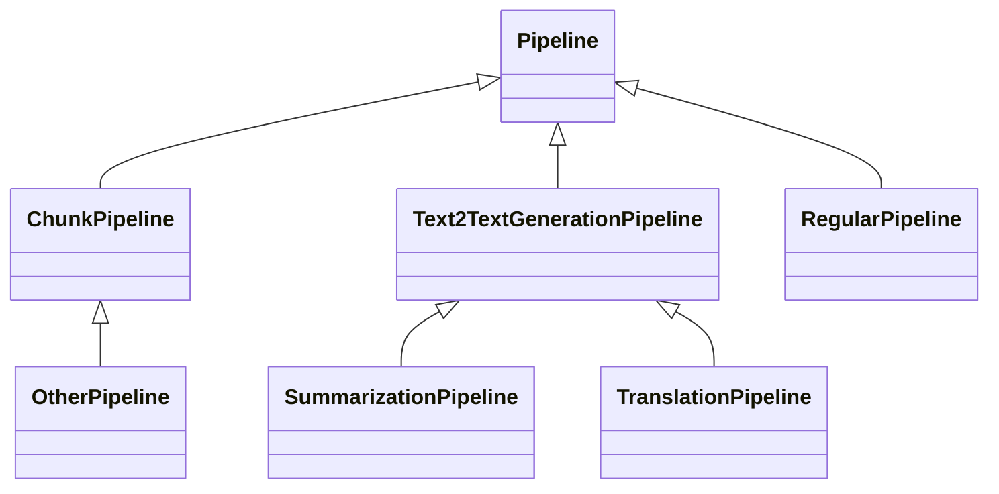
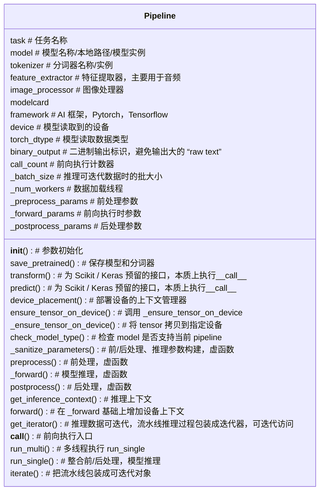
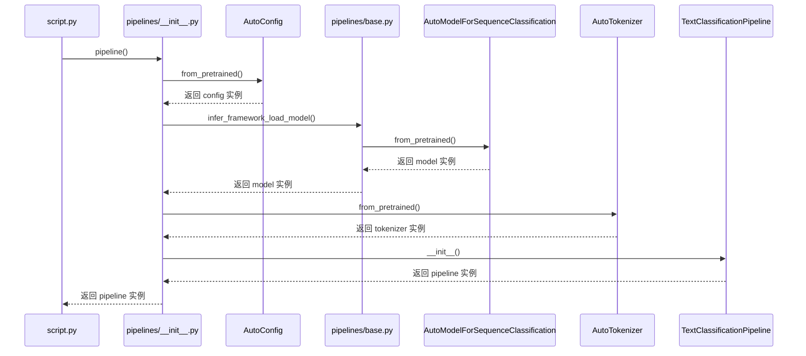
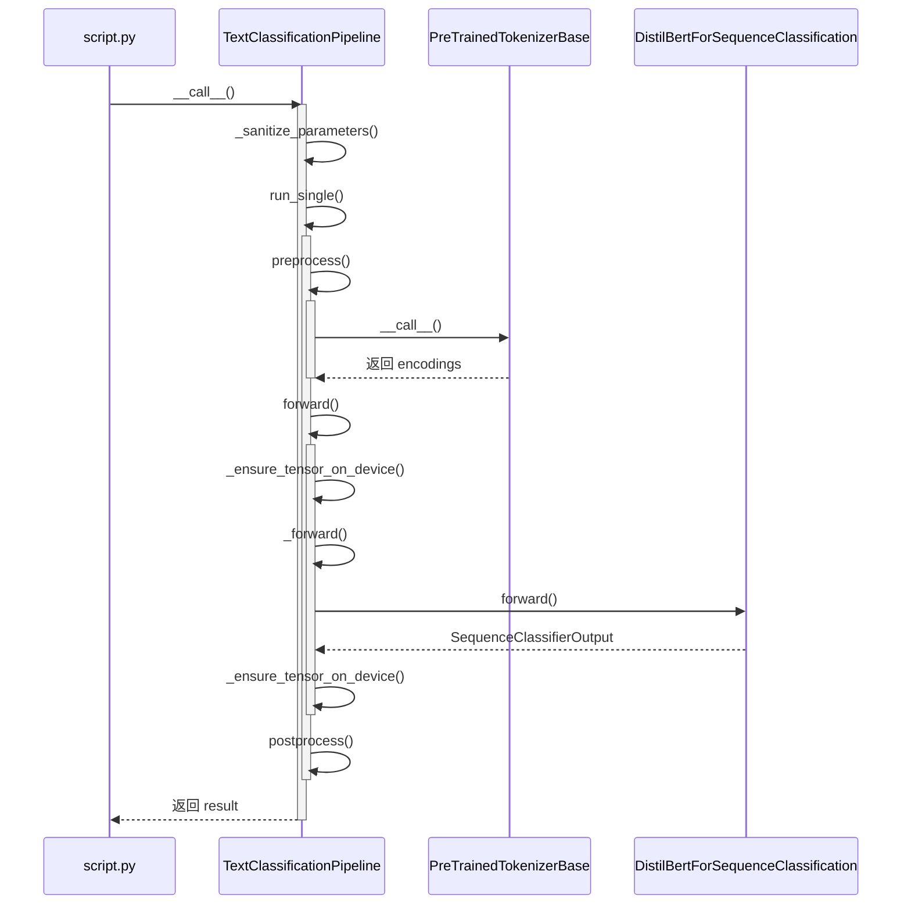

## 基本用法

`Pipelines` 的作用是提供一个模型推理流水线，它的设计理念是极简化流水线的使用，将复杂流程封装在模块内部，对外只接收/输出尽可能原始的数据（如字符串：“Hello”，而不是它的 token ID 或者 embedding），`Pipelines` 涵盖 CV、NLP、Audio 等多个领域的不同任务，例如 `text-generation`, `image-segmentation`, `audio-classification` 等，下面列出 `Pipelines` 的几种典型用法

```python
from transformers import pipeline

# 指定任务类型，利用默认模型创建流水线
pipe = pipeline(task="text-classification")
result = pipe("This restaurant is awesome")
```

```python
from transformers import pipeline

# 指定模型，通过模型卡片信息推断出流水线类型
segmenter = pipeline(model="facebook/detr-resnet-50-panoptic")
segments = segmenter("https://huggingface.co/datasets/Narsil/image_dummy/raw/main/parrots.png")
```

```python
from transformers import pipeline
from transformers import AutoTokenizer, LlamaForCausalLM

# 先创建分词器和模型实例
tokenizer = AutoTokenizer.from_pretrained("llama-2-7b", trust_remote_code=True)
model = LlamaForCausalLM.from_pretrained("llama-2-7b", trust_remote_code=True, device_map="auto", max_length=100)

# 将实例传给指定任务的流水线
pipe = pipeline(task="text-generation", model=model, tokenizer=tokenizer)

# 输入可以是列表/数据集等可迭代对象
inputs = ["This is my ", "I need a "]
results = pipe(inputs)
print(results)
```

可以看出，Pipeline 实例是通过函数 `transformers.pipeline` 来创建的，创建方式比较灵活，可以通过任务名称、模型名称、模型实例来创建；使用方法简单，直接用实例的变量名进行访问，本质上是调用了 `__call__` 函数，输入\输出也比较接近原始数据

## 模块结构

主要类关系如下，所有任务的流水线类都直接或间接继承自 `Pipeline`，其中 `RegularPipeline` 代表大多数正常的流水线类，对于文本到文本类型的任务，中间有一层 `Text2TextGenerationPipeline`，`ChunkPipeline` 是针对“单个输入会执行多次 `forward` 函数”的情况
 


`RegularPipeline` 具体指代的类有
- `AudioClassificationPipeline`
- `ZeroShotAudioClassificationPipeline`
- `FeatureExtractionPipeline`
- `ConversationalPipeline`
- `FillMaskPipeline`
- `TableQuestionAnsweringPipeline`
- `TextClassificationPipeline`
- `TextGenerationPipeline`
- `DepthEstimationPipeline`
- `ImageClassificationPipeline`
- `ImageSegmentationPipeline`
- `ImageToTextPipeline`
- `ObjectDetectionPipeline`
- `VideoClassificationPipeline`
- `VisualQuestionAnsweringPipeline`
- `ZeroShotImageClassificationPipeline`

`OtherPipeline` 具体指代的类有
- `AutomaticSpeechRecognitionPipeline`
- `DocumentQuestionAnsweringPipeline`
- `QuestionAnsweringPipeline`
- `TokenClassificationPipeline`
- `ZeroShotClassificationPipeline`
- `MaskGenerationPipeline`
- `ZeroShotObjectDetectionPipeline`


`Pipeline` 主要成员变量和函数如下，继承它的子类需要实现 `_sanitize_parameters()`, `preprocess()`, `_forward()`, `postprocess()` 虚函数，以及根据需要重写其它函数



## 执行逻辑

### 创建流程

所有 `Pipeline` 类型通过 `transformers.pipeline` 方法进行创建，从下面 `pipeline()` 方法的代码片段可以看出，会根据 `task` 获取对于的流水线类型，并保存在变量 `pipeline_class` 中，最后返回值是利用 `pipeline_class` 创建的流水线实例，主要输入有 `model`, `framework` 和 `task`，而这些对象在 `pipeline()` 输入中时可选的，给出其中一个，其它的可以自动推断出来

```python
# transformers/pipelines/__init__.py
def pipeline(
    task: str = None,
    model: Optional[Union[str, "PreTrainedModel", "TFPreTrainedModel"]] = None,
    config: Optional[Union[str, PretrainedConfig]] = None,
    tokenizer: Optional[Union[str, PreTrainedTokenizer, "PreTrainedTokenizerFast"]] = None,
    feature_extractor: Optional[Union[str, PreTrainedFeatureExtractor]] = None,
    image_processor: Optional[Union[str, BaseImageProcessor]] = None,
    framework: Optional[str] = None,
    revision: Optional[str] = None,
    use_fast: bool = True,
    use_auth_token: Optional[Union[str, bool]] = None,
    device: Optional[Union[int, str, "torch.device"]] = None,
    device_map=None,
    torch_dtype=None,
    trust_remote_code: Optional[bool] = None,
    model_kwargs: Dict[str, Any] = None,
    pipeline_class: Optional[Any] = None,
    **kwargs,
) -> Pipeline:
...
# Retrieve the task
if task in custom_tasks:
    normalized_task = task
    targeted_task, task_options = clean_custom_task(custom_tasks[task])
    if pipeline_class is None:
        if not trust_remote_code:
            raise ValueError(
                "Loading this pipeline requires you to execute the code in the pipeline file in that"
                " repo on your local machine. Make sure you have read the code there to avoid malicious use, then"
                " set the option `trust_remote_code=True` to remove this error."
            )
        class_ref = targeted_task["impl"]
        pipeline_class = get_class_from_dynamic_module(
            class_ref, model, revision=revision, use_auth_token=use_auth_token
        )
else:
    normalized_task, targeted_task, task_options = check_task(task)
    if pipeline_class is None:
        pipeline_class = targeted_task["impl"]
...

return pipeline_class(model=model, framework=framework, task=task, **kwargs)
```

以流水线创建代码 `pipe = pipeline(task="text-classification")` 为例，流水线创建过程如下，首先是通过 `task` 找到模型名字（步骤略），然后根据模型名字创建配置实例 `config`，然后根据 `config` 等信息创建模型实例 `model`，由于是 NLP 任务，需要根据模型创建 `tokenizer` 实例，最后利用所有得到的实例创建 `pipeline` 实例



### 推理流程

Pipeline 实例可以通过实例变量接受输入文本实现推理，本质上是调用了魔法函数 `__call__` ，所有的调用逻辑都封装在 `__call__` 函数内，父类 `Pipeline` 已经把 `__call__` 内部流程和框架定义好，并实现了一些通用功能，`__call__` 的主体是 `run_single` 函数，它封装了预处理、推理、后处理步骤。整体逻辑分为四个大步骤：

1. 参数创建：通过 `_sanitize_parameters` 函数创建预处理、推理、后处理的参数
2. 预处理：函数 `preprocess` 对输入数据进行加工处理，例如，NLP 任务中对文本进行 tokenization，CV 任务中对图片进行缩放和数值规范化
3. 前向推理：`forward` 函数将推理过程进一步包装， 在执行 `_forward` 前后各执行一次 `_ensure_tensor_on_device`，其中 `_forward` 内部真正调用模型的推理接口，而 `_ensure_tensor_on_device` 主要功能是确保输入/输出在正确的设备上
4. 后处理：对模型输出结果进行后处理，例如，NLP 任务对 token 进行文本转换等



## 注册自定义 Pipeline

 如上一章节介绍，Pipeline 实例的推理过程已经进行了标准化的封装，自定义 Pipline 继承父类在此基础上稍加修改，并注册到 `transformers` 库中即可使用

 参考[官网案例](https://huggingface.co/docs/transformers/add_new_pipeline)，首先自定义一个 `MyPipeline` 类继承自父类 `Pipeline`，根据自己任务的特点，分别实现 `_sanitize_parameters`, `preprocess`, `_forward`, `postprocess` 这四个函数，将代码保存在 `pair_classification.py` 文件中

 ```python
 import numpy as np

from transformers import Pipeline

def softmax(outputs):
    maxes = np.max(outputs, axis=-1, keepdims=True)
    shifted_exp = np.exp(outputs - maxes)
    return shifted_exp / shifted_exp.sum(axis=-1, keepdims=True)

class PairClassificationPipeline(Pipeline):
    def _sanitize_parameters(self, **kwargs):
        preprocess_kwargs = {}
        if "second_text" in kwargs:
            preprocess_kwargs["second_text"] = kwargs["second_text"]
        return preprocess_kwargs, {}, {}

    def preprocess(self, text, second_text=None):
        return self.tokenizer(text, text_pair=second_text, return_tensors=self.framework)

    def _forward(self, model_inputs):
        return self.model(**model_inputs)

    def postprocess(self, model_outputs):
        logits = model_outputs.logits[0].numpy()
        probabilities = softmax(logits)

        best_class = np.argmax(probabilities)
        label = self.model.config.id2label[best_class]
        score = probabilities[best_class].item()
        logits = logits.tolist()
        return {"label": label, "score": score, "logits": logits}
 ```

 在使用自定义 `Pipeline` 类时，需要先进行注册

 ```python
from pair_classification import PairClassificationPipeline
from transformers.pipelines import PIPELINE_REGISTRY
from transformers import AutoModelForSequenceClassification, TFAutoModelForSequenceClassification

PIPELINE_REGISTRY.register_pipeline(
    "pair-classification",
    pipeline_class=PairClassificationPipeline,
    pt_model=AutoModelForSequenceClassification,
    tf_model=TFAutoModelForSequenceClassification,
)
 
 ```

 注册后即可像内置 `Pipeline` 一样进行调用
 
 ```python
 from transformers import pipeline

classifier = pipeline("pair-classification", model="sgugger/finetuned-bert-mrpc")
 ```

 另外，Hugging Face 提供将自定义 `Pipline` 进行上传和下载的结构，方便自定义 `Pipline` 的分享

 ```python
 # 上传
 from huggingface_hub import Repository

repo = Repository("test-dynamic-pipeline", clone_from="{your_username}/test-dynamic-pipeline")
classifier.save_pretrained("test-dynamic-pipeline")
repo.push_to_hub()
 ```


```python
# 下载
from transformers import pipeline

classifier = pipeline(model="{your_username}/test-dynamic-pipeline", trust_remote_code=True)
```